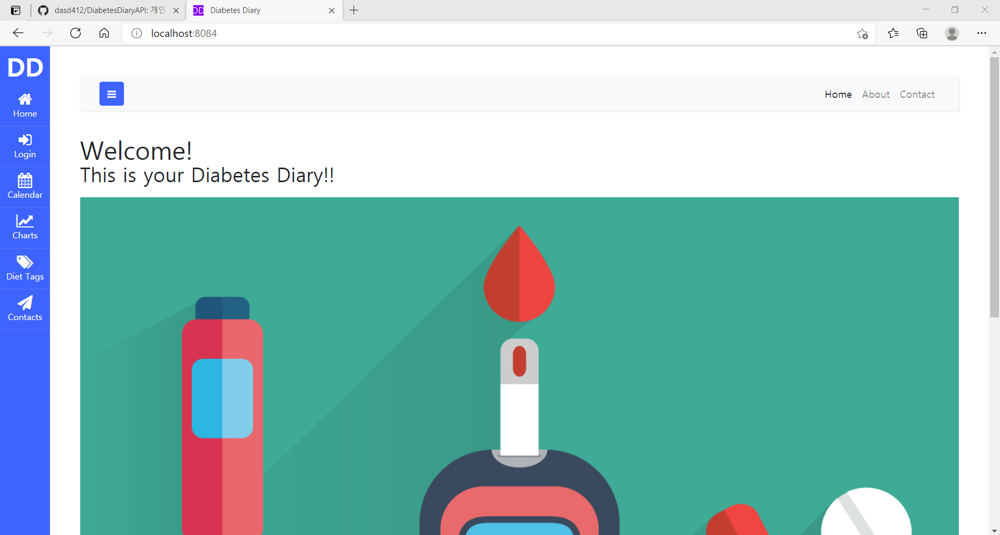
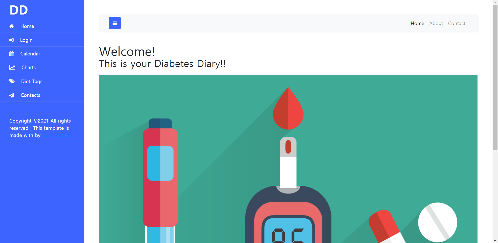
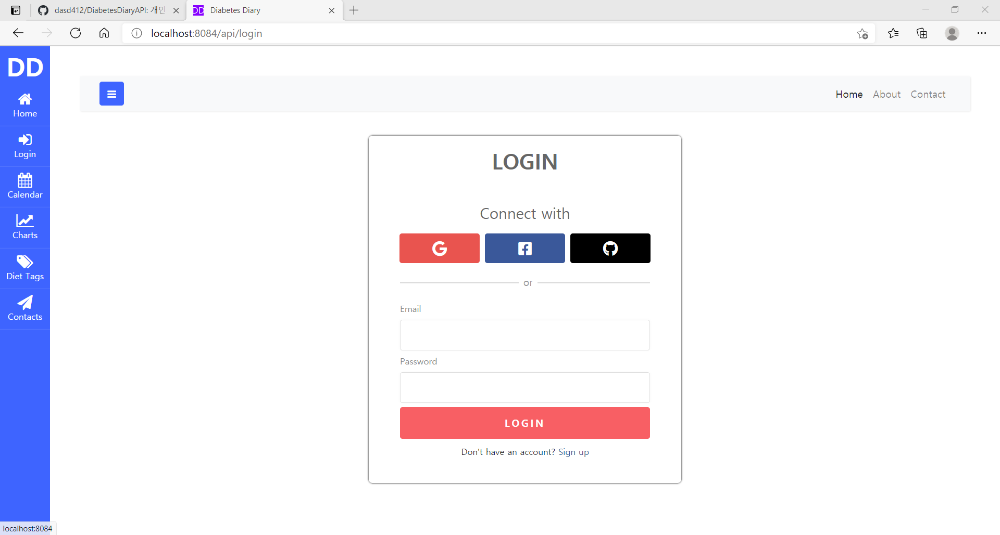
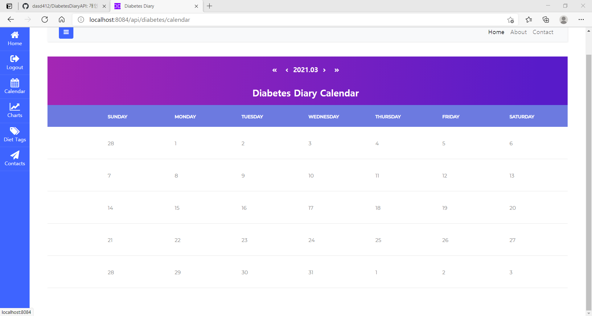
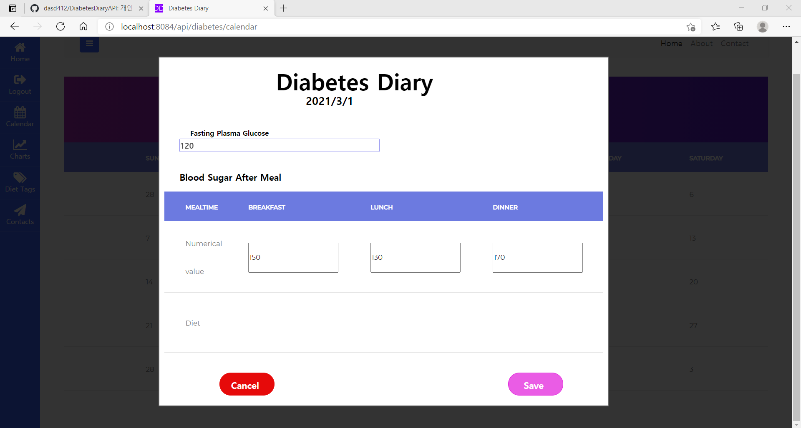
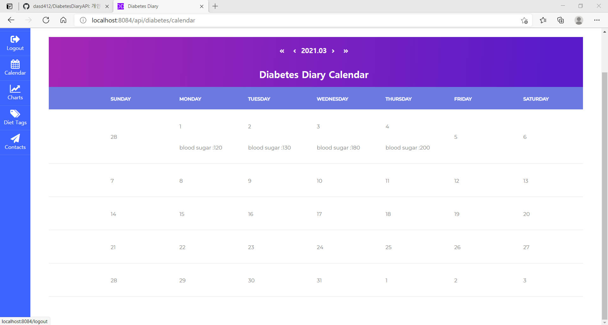
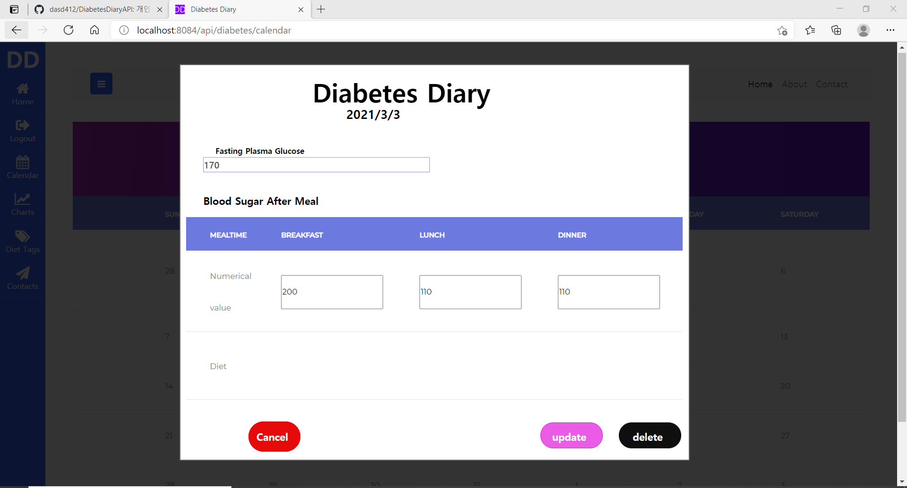
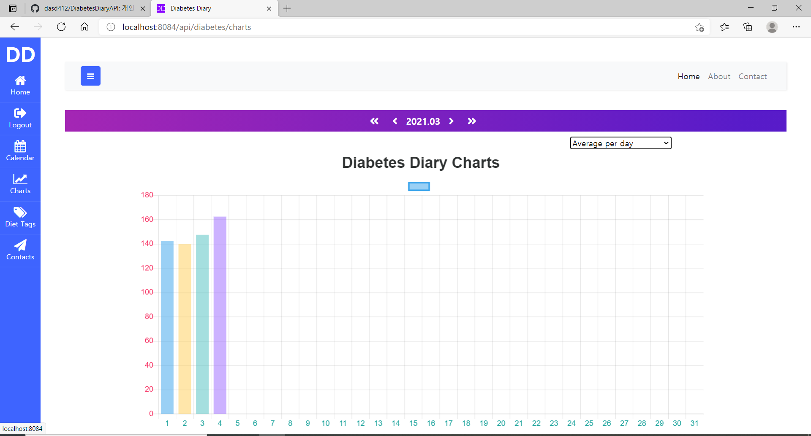
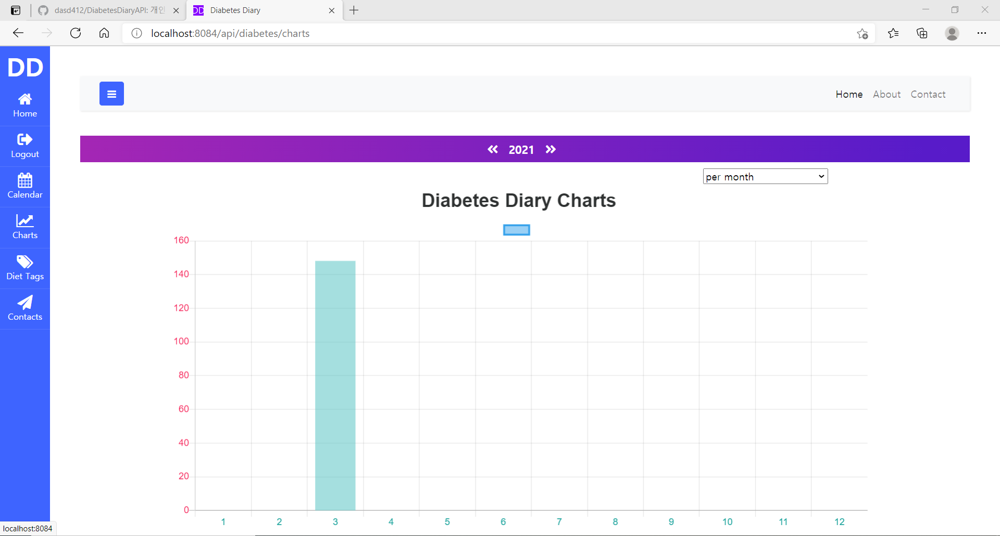

# __Diabetes Diary API__
#### _Private portfolio by <u>dasd412</u>_

---

+ 기능 설명

1. 당뇨병 환자의 혈당(공복 혈당, 아침 혈당, 점심 혈당, 저녁 혈당)을 달력형 게시판에 기록할 수 있다.
1. 달력형 게시판에 기록된 혈당 수치를 막대형 그래프로 보여줄 수 있다. (월별, 일별 선택 가능)
1. 구글 로그인 등 OAuth를 활용하여 가입 및 로그인할 수 있다.
1. 식단 태그를 활용하여 중복되는 식사 내용을 태그로 입력할 수 있다. (추가 예정)
1. 영어, 한국어 다국어 처리를 할 수 있다.(추가 예정)

+ Key Summary
 1. Junit을 활용하여 Repository, Controller 유닛 테스트를 진행 하였다.
 1. API 문서화를 Swagger로 하였다.
 1. 커스텀 에러 페이지 처리

+ Folder Structure 소개

```
+-- src.main
        +-- java
             +--com.dasd412
                +--configure
                   SecurityConfigure 
                   ServiceConfigure (i18n)
                   Swagger2Configure
                   WebMvcConfigure (annotation resolving)

                +--controller
                   +--calendar
                      CalendarController

                   +--charts
                      AverageChartDTO
                      chartsController
                      chartsRestController
                      DayChartRequestDTO

                   +--diabetesDiary
                      DiabetesDiaryRequestDTO
                      DiabetesDiaryRestController
                      DiabetesDiaryUpdateRequestDTO
                      DiabetesResponseDTO

                   +--error
                      NotFoundException
                      ServiceRuntimeException

                   +--index
                      IndexController

                   +--security
                      LoginController

                   ApiError (응답 DTO 에러 내용 규격화)
                   ApiResult (응답 DTO 내용 규격화)
                   LayoutAdivce (mustache layout)

                +--domain
                   +--commons
                      Id (DTO 전송 규격화하는데 쓰임.)

                   +--diary
                      DiabetesDiary
                      DiabetesDiaryRepsository

                   +--diet<아직 미구현>

                   +--user
                      Role
                      Writer
                      WriterRepository

                   BaseTimeEntity 
                +--security
                   LoginUser (annotaion)
                   LoginUserArgsResolver
                   OAuthAttributes 
                   SessionUser

                +--service
                   +--charts
                      ChartSevice
                   +--diabetesDiaryForm
                      DiabetesDiarySevice
                   +--sercurity
                      CustomUserSevice

                +--utils
                   EmailUitls
                   MessageUtils

                Applictaion

        +-- resources
             +--i18n
                messages.properties

             +--static
                +--css
                    +--calendar
                       calendar.css
                    +--charts
                       charts.css
                    +--login
                       login.css
                    button.css
                    styleDDForm.css
                    welcome.css

                +--images
                DDIndex.jpg

                +--js.app
                   +--calendar
                       calendar.js
                       calendarSchedule.js
                       Formatter.js
                       stringBuffer.js

                   +--charts
                       chart.js

                +--sidebar-07(메뉴 뷰 템플릿)
                +--vendor(달력 뷰 템플릿)

                favicon.ico

             +--templates
                +--calendar
                    calendar.mustache

                +--charts
                    charts.mustache

                +--error
                    400.mustache
                    404.mustache
                    405.mustache
                    415.mustache
                    500.mustache

                +--layout
                    calendarFooter.mustache
                    calendarHeader.mustache
                    layout.mustache

                +--login
                    login.mustache

                index.mustache

                application.properties
                logback.xml
+-- src.test
    +--controller
       +--charts
          ChartsRestControllerTest
       +--diabetesDiary
          DiabetesDiaryRestControllerTest
    +--domain.diary
       DiabetesDiaryRepositoryTest
```
+ Backend Architecture

  + EndPoints 소개
    + @GET / 
    + @GET /api/diabetes/calendar
    + @GET /api/login
    + @GET /api/diabetes/charts/average
    + @GET /api/diabetes/charts/list
    + @GET /api/diabetes/charts
    + @GET /api/diabetes/diary/{id}
    + @PUT /api/diabetes/diary/{id}
    + @DELETE /api/diabetes/diary/{id}
    + @GET /api/diabetes/diary/list
    + @POST /api/diabetes/diary/post
    
  + Controller, Service, Repository 관계도
  + DB 스키마

+ Frontend Architecture
  + Index View 
  
  
  + Index Menu View
  
  
  + Login View
  

  + Calendar View
   
  
  + Form for save
  
  
  + CalendarSaved
   
  
  + Form for updating and deleting
  
  
  + Daily Average Chart
  
  
  + Monthly Average Chart
  

+ 설치 방법

+ 실행 방법 

+ 향후 추가할 기능들
  + ~~로그인~~ (페이스북, 깃 연동 등은 나중에 할 예정)
  + 식단 태그 기능(테스트 실패. 혈당 일지 작성 완료 후 다시 시도)
  + 다국어 처리
  
 + 사용 API
   + Swagger
   + BootStrap
   + sweet alert 
   + JS Chart
   
 + 사용 툴
   + Adobe XD 
   + 제플린
   + ERD Cloud
   + FontAwesome
   + ColorLib
   + Post Man
---
## __설계 계획__

1. 환경 설정
2. DB 스키마 작성
3. 백엔드 쪽 만든 후, H2와 POSTMan 활용하여 테스트
4. 프론트엔드 라이브러리 선택 후 활용
5. 배포

---
~~혈당 일지 작성~~

~~달력 게시판~~

~~메뉴 구현~~

~~로그인 구현~~

~~그래프 구현~~

~~커스텀 에러 페이지 처리~~

### _Iteration -  7_ ###

식단 태그 기능
